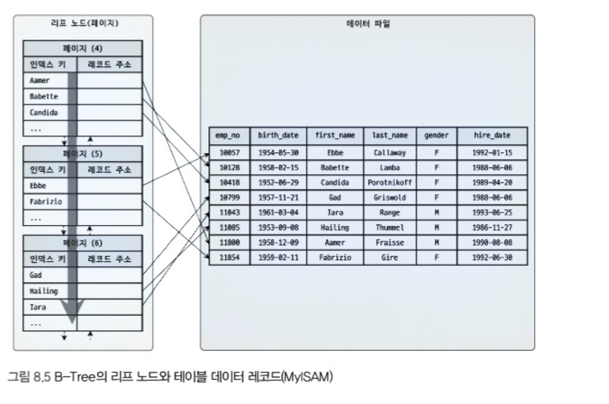
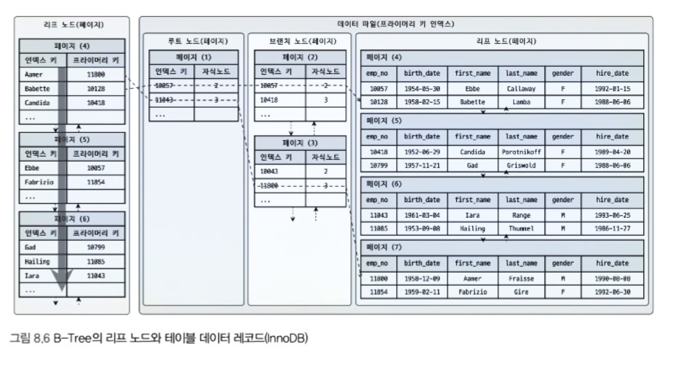
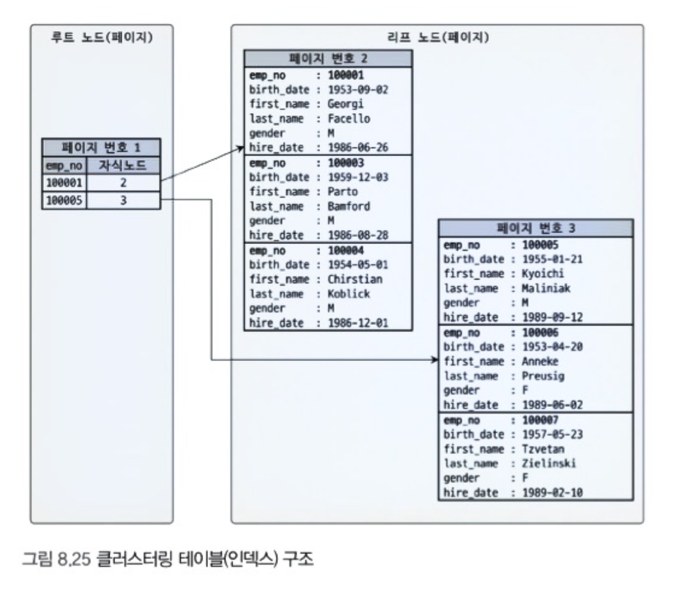

# 인덱스 (MySql)

데이터베이스 테이블의 모든 데이터를 검색해서 원하는 결과를 가져오려면 시간이 오래 걸린다.
이를 해소하기 위해 칼럼(들)의 값과 해당 레코드의 주소를 key-value로 만든것이 인덱스이다.
인덱스는 정렬되어 있다는 특징이 있어 최대한 빠르게 찾아갈 수 있다.

이러한 정렬되어 있다는 특징때문에 데이터를 저장할 때 또한 항상 정렬을 진행해야 해서 INSERT, UPDATE, DELETE의 처리가 SELECT에 비해 월등히 느리다.

## 인덱스 생성
 CREATE INDEX <인덱스명> ON <테이블명> ( 칼럼명1, 칼럼명2, ... );
  과 같은 방식으로 인덱스를 생성할 수 있다.

B-Tree, Hash, Fractal, Merge-Tree 같은 여러 방식이 존재하지만, B-Tree 방식 인덱스만 주로 사용한다.

## B-Tree 인덱스
루트 노드, 브랜치 노드, 리프 노드로 이루어져 있다.
리프노드에는 실제 데이터에 접근할 수 있도록 주솟값을 가지고 있게 된다.

리프노드에 저장되는 주솟값의 형태는 mysql 스토리지 엔진에 따라 다를 수 있다. 
MyISAM의 경우에 리프노드에 물리 주소값이 저장되어 있어 인덱스 검색 후, 바로 데이터 레코드에 접근할 수 있다.

하지만 InnoDB의 경우 리프노드에 프라이머리 키가 저장되어 있다. 따라서 물리 주소가 아닌 논리적인 주소가 저장된 형태이며, 실제 데이터 레코드에 접근하기 위해서는 프라이머리 키가 저장된 인덱스를 한번 더 탐색해야 접근 가능하다.

(현재 mysql의 기본 스토리지 엔진이 InnoDB이기 때문에 설정을 바꾸지 않았다면 InnoDB를 사용하게 된다.)

### 인덱스 레인지 스캔
검색해야 할 인덱스의 범위가 주어졌을 때 사용된다.
전체를 스캔하는 것이 아닌 범위만 스캔하게 된다.

스캔 후, 조건과 일치하는 레코드를 읽기 위해 랜덤 I/O가 일어난다. 랜덤 I/O는 비용이 많이 드는 작업이고, 만약 읽어야 하는 데이터 레코드가 20~25%를 넘어가면 인덱스보다 테이블 스캔이 효율적이다.

### 인덱스 풀 스캔
말 그대로 인덱스를 처음부터 끝까지 풀스캔 하는 방식이다.
인덱스의 크기가 테이블의 크기보다 작기 때문에 테이블을 풀스캔 하는것 보다는 효율적이지만, 인덱스 생성 의도와는 맞지 않는 방식.

## 다중 칼럼 인덱스
2개 이상의 칼럼을 포함하는 인덱스이다.
인덱스는 정렬되어 있기 때문에 다중 칼럼 인덱스도 정렬이 되어있다. 하지만 2개 이상의 칼럼을 갖고 있기 때문에, 첫번째 칼럼을 정렬하고, 두번째 칼럼은 첫번째 칼럼에 의존해서 정렬되어 있다. 

따라서 다중 칼럼 인덱스를 사용할 때에는 자주 사용하는 WHERE 절에 맞게 인덱스 조합 순서를 결정해야 한다.

## 클러스터링 인덱스 (InnoDB를 사용하는 경우)
클러스터링 인덱스는 프라이머리 키에만 적용되는 내용이다.
프라이머리 키 값이 비슷한 레코드들 끼리 묶어서 저장하는 것이 클러스터링 인덱스이다.

프라이머리 키 값에 의해 레코드의 저장 위치가 결졍되고, 프라이머리 키가 바뀌면 저장 위치도 바뀌게 된다. (인덱스 알고리즘보다는 테이블 레코드의 저장 방식으로 생각할 수 있다.)

InnoDB는 항상 클러스터링 인덱스로 테이블이 저장되기 때문에 프라이머리 키 기반 검색이 매우 빠르며, 대신 저장이 상대적으로 느리다. 

## 커버링 인덱스

커버링 인덱스는 쿼리의 조건을 모두 충족하고 있는 인덱스를 뜻한다.

id라는 칼럼이 프라이머리 키인 상태에서

select * from user
where id = 1;

위의 쿼리를 다음과 같이 바꾸면

select id from user
where id = 1;

질의에 사용되는 모든 칼럼이 인덱스에 포함되어 있으므로, 데이터 테이블까지 접근하는 과정이 생략된다.

인덱스 레인지 스캔시 테이블 레코드에 최종적으로 접근하기 위해서는 데이터 수 만큼의 랜덤 I/O가 일어나는데, 커버링 인덱스를 이용하면 랜덤 I/O 과정이 생략되므로 성능이 향상되는 효과를 볼 수 있다.